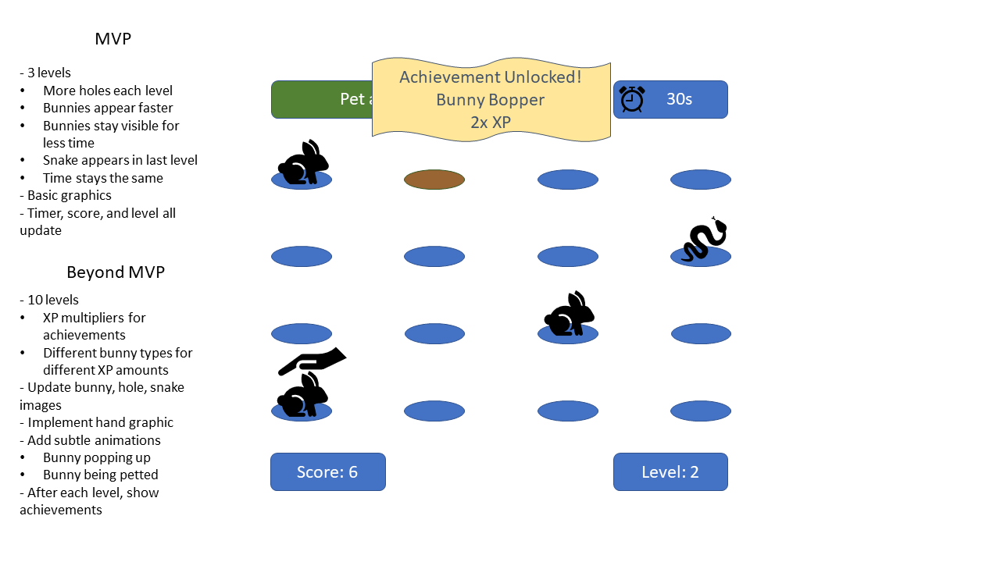
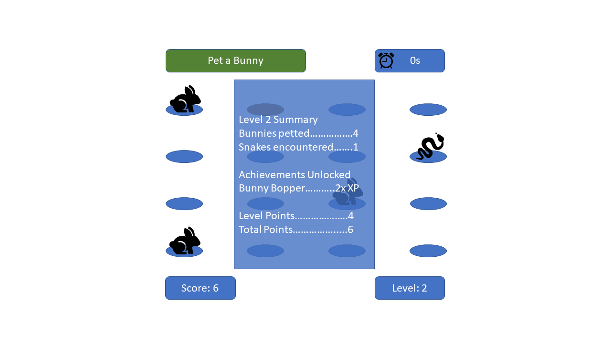
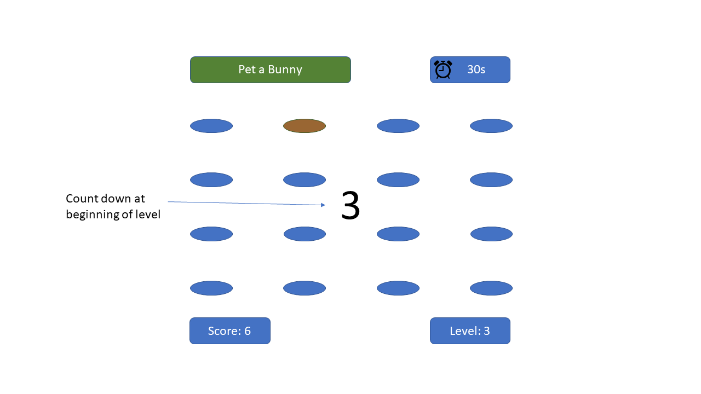

# Project 0: The Game
## Introducing Pet-a-Bunny
Like Whack-a-Mole, but friendlier and with bunnies!

## Installation Instructions
Open a browser, such as Chrome. Click [here](https://pages.git.generalassemb.ly/judykim-ga/pet-a-bunny/) to open the game.

## User Stories
When the user opens the game, they first see instructions on how to play. When they press start, the first level appears, the timer starts, and bunnies start popping out of their hole. The user tries to pet as many as possible before the time runs out, trying to achieve game bonuses along the way. When the timer hits 0, the level ends and game stats are displayed. The user clicks the Next Level button to start the next level. During the game, a Restart button is available to start over. When the game is over, a game summary screen appears.

## Wireframes

## Technologies Used
HTML, CSS, JavaScript, jQuery

## Approach Taken
Throughout the project, I grouped features together and went through the following process:  

Idea -> Plan -> Code -> Test -> Extend -> Fix -> Refine

* **Idea**: I came up with something I wanted to implement, such as a group of different game bonuses.  

* **Plan**: I drew and wrote up what the idea would look like, what data structure I would use, what logic I would need, when it would be executed.  

* **Code**: I chose one thing, such as giving a bonus for clicking enough gold bunnies, and typed up what was needed to get it to work. I tried to keep code readability and extensibility in mind, but in this phase I often had to hard-code in values.

* **Test**: Did it appear how I wanted in the browser? Did it behave how I wanted it to? Did it make the right changes to the game?

* **Extend**: If the tests failed, I circled back to planning. If the tests went well, I extended the code to a feature in the same group. For example, I used the same logic to give a bonus for clicking enough white bunnies, then the same logic for clicking snakes and normal bunnies.

* **Fix**: At this point, I would go back to refactor and remove any hard-coded values that could be replaced. This often broke things, but I worked to fix the code until the features behaved correctly again.

* **Refine**: Now that things were working, I refactored some more to improve efficiency, readability, and extensibility.

These are the groups of features that I made: Gameboard, Animals, Buttons, Transition Screens, Achievements

## Unsolved Problems & Future Features
I would like to keep adding the following features:
- High score history 
- Visual feedback that the animal was clicked
- More levels with hole patterns that aren't squares
- More achievements that can be unlocked